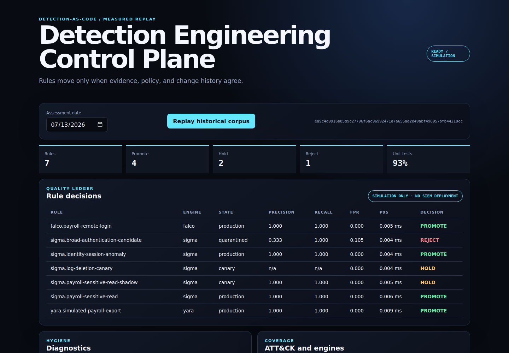

# detection-as-code-platform

A self-contained detection engineering control plane for versioning, validating,
replaying, measuring, and **simulating** lifecycle decisions for Sigma, YARA, and
Falco rules.

The repository is intentionally evidence-first: every rule has an owner, threat
coverage, positive and negative tests, an expiry date, performance budgets, and a
requested lifecycle transition. A historical replay produces precision, recall,
false-positive rate, alert volume, measured latency, silence/noise/redundancy
diagnostics, a deterministic policy decision, and a hash-chained audit trail.

> The platform does not deploy to a SIEM, EDR, Falco sensor, or Kubernetes
> cluster. `PROMOTE`, `HOLD`, and `REJECT` are deterministic simulations backed by
> local fixtures.

## Running example



Historical corpus replay, showing rule promotion decisions and diagnostic checks. [Commands and test results](docs/verification.md).

## Measured reference run

The committed [reference snapshot](snapshots/2026-07-13/replay-report.md) is
reproducible from the vendored bundle:

| Evidence | Result |
|---|---:|
| Versioned rules | 7 |
| Historical replay cases | 22 |
| Positive/negative rule tests | 14 |
| Test pass rate | 92.9% |
| Simulated decisions | 4 promote / 2 hold / 1 reject |
| Deliberately detected defects | 1 noisy, 1 silent, 1 redundant candidate |
| Engines exercised | Sigma subset, Falco subset, official YARA runtime |

The failing negative test is deliberate: the broad authentication candidate is
included to prove that the policy quarantines a noisy rule. All seven expected
policy outcomes must match for CI to pass.

## Architecture

```text
versioned manifests + pinned rule sources + integrity-pinned corpus
                              |
                    strict contract validation
                              |
          +-------------------+-------------------+
          |                   |                   |
   Sigma subset         Falco subset       yara-python 4.5.4
          +-------------------+-------------------+
                              |
              unit fixtures + historical replay
                              |
       confusion matrix / latency / silence / noise / redundancy
                              |
           deterministic PROMOTE / HOLD / REJECT simulation
                              |
       JSON + CSV + Markdown + hash-chained audit + dashboard
```

The runtime has no process-execution or outbound-network client surface. It reads
the packaged bundle, compiles rules, evaluates inert local data, and serves a
read-only local dashboard plus one bounded replay endpoint. See
[Architecture](docs/ARCHITECTURE.md) and [Threat model](docs/THREAT_MODEL.md).

## Quick start

Python 3.10–3.12 and a C toolchain compatible with the `yara-python` wheel are
supported.

```bash
python -m venv .venv
. .venv/bin/activate
python -m pip install -r requirements-build.lock -r requirements-runtime.lock -r requirements-dev.lock
python -m pip install --no-build-isolation --no-deps -e .

detection-platform validate
detection-platform replay --as-of 2026-07-13 --output-dir out/replay
detection-platform serve --host 127.0.0.1 --port 8080
```

Open `http://127.0.0.1:8080`. The dashboard triggers the same measured replay as
the CLI and exposes coverage, rule quality, decisions, and diagnostic evidence.

For a constrained container runtime:

```bash
docker compose up --build
```

Compose binds only to loopback, runs a non-root image with a read-only filesystem,
drops all Linux capabilities, sets `no-new-privileges`, and caps processes, CPU,
and memory.

## Commands and API

```text
detection-platform validate
detection-platform rules
detection-platform verify-dataset [--upstream PATH]
detection-platform replay [--as-of YYYY-MM-DD] [--output-dir PATH] [--full]
detection-platform serve [--host HOST] [--port PORT]
```

HTTP endpoints:

| Method | Path | Purpose |
|---|---|---|
| GET | `/api/v1/health` | Runtime status and explicit simulation mode |
| GET | `/api/v1/rules` | Versioned metadata without absolute host paths |
| GET | `/api/v1/datasets` | Corpus inventory and provenance checks |
| POST | `/api/v1/replay` | Replay with exactly `{"as_of":"YYYY-MM-DD"}` |

The API rejects duplicate JSON keys, extra request fields, oversized bodies, and
unsupported media types. It does not accept rule uploads or arbitrary queries.

## Rule contract

Each YAML manifest binds its source file by SHA-256 at load time and requires:

- immutable identifier and monotonically increasing revision;
- owner, description, dates, status, and explicit expiration;
- threat summary, severity, and MITRE ATT&CK technique/tactic mappings;
- at least one positive and one negative case;
- minimum precision/recall and maximum FPR/latency/alert-volume budgets;
- current/requested state, canary percentage, and expected policy decision.

The complete schema and review workflow are documented in
[Rule contract](docs/RULE_CONTRACT.md).

## Execution profiles

- **Sigma:** executable event-selection subset with named mappings, `and`, `or`,
  `not`, parentheses, exact values, `contains`, `startswith`, and `endswith`.
  Correlations, aggregations, wildcards, quantifiers, and backend pipelines fail
  closed.
- **Falco:** executable single-rule filter subset over an explicit normalized field
  allowlist, with boolean operators, `=`, `!=`, `contains`, and `in`. Unknown
  fields/operators fail closed.
- **YARA:** source is compiled and executed by `yara-python==4.5.4`; external
  includes and modules are rejected, evaluation has a one-second timeout, and only
  the declared entrypoint is accepted.

This is not a claim of complete Sigma or Falco compatibility. The exact grammar,
ground-truth design, and metric definitions live in
[Methodology](docs/METHODOLOGY.md).

## Cross-project golden-data integration

The `autonomous-payroll` dataset is a byte-identical, packaged copy of the
`payroll-no-malware` golden telemetry produced by
`autonomous-incident-simulator`. Its report and telemetry hashes, source scenario,
repository locator, and canonical report digest are stored in a provenance
contract. Runtime and CI do not rely on a sibling checkout.

When both repositories are present, verify byte identity explicitly:

```bash
detection-platform verify-dataset \
  --upstream ../autonomous-incident-simulator/datasets/golden/payroll-no-malware
```

See [Integration dataset](docs/INTEGRATION_DATASET.md).

## Quality gates

```bash
make test
make quality
```

CI runs on Python 3.10, 3.11, and 3.12 and enforces formatting, lint, strict
typing, compilation, 34 unit/integration/end-to-end tests, source-surface safety,
functional determinism, dataset provenance, policy outcomes, snapshot integrity,
and a constrained container validation. Dependencies, build tooling, base image,
and CI actions are version/digest pinned.

## Repository map

```text
src/detection_platform/
  engines/          strict executable Sigma/Falco profiles and official YARA adapter
  bundle/           packaged manifests, sources, corpora, and provenance
  web/              dependency-free dashboard
  replay.py         metrics, diagnostics, lifecycle policy, audit evidence
tests/               unit, integration, API, CLI, and tamper tests
scripts/             CI policy, safety, provenance, and snapshot gates
snapshots/           committed measured evidence
docs/                architecture, methodology, contract, threat model, limitations
```

## Security and limitations

Report vulnerabilities according to [SECURITY.md](SECURITY.md). Before using any
result outside this lab, read [Limitations](docs/LIMITATIONS.md): the corpus is
small and synthetic, labels are rule-scoped, latency is microbenchmark evidence
rather than production throughput, and all lifecycle effects are simulated.

## License

MIT — see [LICENSE](LICENSE).
